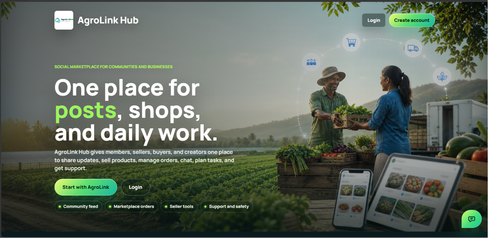

# AgroLink Hub

AgroLink Hub is a full-stack social commerce platform for farmers, small businesses, buyers, creators, and community users. I built it as one connected workspace where people can post updates, discover sellers, chat, list products, manage carts and orders, track activity, request support, and keep a local marketplace active around real user relationships.

The main idea is simple: sellers should not need one app for audience, another for chat, another for products, and another for orders. AgroLink Hub keeps those daily workflows together.



[Project Report](docs/agrolink-hub-project-report.pdf)

## What The Project Solves

Many small producers already use social media to reach customers, but normal social platforms do not give them proper product listings, carts, seller order management, reviews, or support tools. Marketplace-only systems can handle selling, but they often miss the trust that comes from posts, comments, profiles, reviews, and direct conversation.

AgroLink Hub connects both sides:

- Farmers and producers can share harvest updates, publish products, talk to buyers, and receive orders directly.
- Small businesses can run a lightweight seller page with products, reviews, order status, and analytics.
- Buyers can discover real sellers through both marketplace browsing and community activity.
- Creators and community users can keep the feed active with posts, stories, reactions, comments, friends, follows, and messages.
- Admins can review users, support tickets, reports, moderation states, and platform statistics.

## Main User Flows

| Flow | What happens |
| --- | --- |
| Signup and verification | A user creates an account, receives an OTP email, verifies the account, then enters the protected app shell. |
| Social discovery | Users create posts, view feed content, comment, react, share, save posts, follow users, and manage friends. |
| Seller setup | Business and farmer accounts create seller pages, add products, update availability, and manage received orders. |
| Buyer purchase | Buyers browse marketplace products, add items to the backend cart, checkout, and track order history. |
| Messaging | Users open direct or group conversations, send media, react to messages, and see sent/delivered/read behavior. |
| Support and moderation | Users submit support questions and reports. Admins respond, review reports, and apply moderation actions. |

## Product Areas

| Area | Included work |
| --- | --- |
| Social | Feed, posts, media, poll support, comments, replies, reactions, shares, saved posts, reports, stories, friends, followers, profiles, and notifications. |
| Commerce | Marketplace, product publishing, seller pages, product images, category/price/stock fields, cart persistence, checkout, buyer orders, seller orders, reviews, and analytics. |
| Platform | Signup, login, OTP verification, forgot password, JWT refresh/logout, Google OAuth2, protected routes, role routes, settings, calendar, support center, admin dashboard, and assistant. |
| Realtime | WebSocket/STOMP chat, typing events, presence-style behavior, message reactions, seen state, read ticks, and notification behavior. |
| Operations | PostgreSQL persistence, JPA repositories, schema patching, local upload storage, mail configuration, CORS/cookie settings, and production security notes. |

## Roles

| Role | Access |
| --- | --- |
| `ROLE_USER` | Feed, marketplace buying, cart, buyer orders, chat, support, calendar, profile, and settings. |
| `ROLE_CREATOR` | Social content, community reach, marketplace buying, chat, support, and profile management. |
| `ROLE_BUSINESS` | Seller page, product publishing, seller order management, reviews, and analytics. |
| `ROLE_FARMER` | Farmer seller tools, product listing, received orders, reviews, and analytics. |
| `ROLE_ADMIN` | Admin dashboard, user groups, reports, support tickets, moderation, and platform oversight. |

Admin accounts should be created through a controlled process. Public signup supports normal user, creator, business, and farmer roles.

## Tech Stack

| Layer | Technology |
| --- | --- |
| Frontend | React 18.3.1, Vite 6.3.5, React Router DOM 6.30, Axios 1.8, STOMP client |
| Backend | Java 25, Spring Boot 4.0.2, Spring Security, Spring Data JPA, Spring Mail, WebSocket/STOMP |
| Database | PostgreSQL |
| Auth | Email/password, OTP verification, JWT access/refresh behavior, Google OAuth2 |
| Storage | Local upload folder for development, served through backend resource mapping |
| Styling | Custom CSS system with shared dashboard UI components |

## Architecture

The repository is split into a React frontend and a Spring Boot backend. Both sides follow a similar domain structure, which makes features easier to trace from UI to API to service logic.

```text
agrolink-hub/
  Lisharefrontend/
    src/
      assets/          # branding, landing images, auth backgrounds, workspace visuals
      modules/
        business/      # admin, analytics, cart, orders, products, business pages, reviews, support
        platform/      # app routes, auth, calendar, common UI, layouts, support, users
        social/        # feed, posts, chat, chatbot, friends, follows, notifications
      dashboard-ui.css
      feed-card-reference.css
      index.css

  Lisharebackend/
    src/main/java/com/socialApp/Lishare/
      modules/
        business/      # products, cart, orders, seller pages, reviews, support, admin
        platform/      # auth, users, calendar, security, storage, config, utilities
        social/        # posts, stories, comments, reactions, shares, chat, friends, follow, notifications
    src/main/resources/
      application.yaml
      schema.sql
    .env.example
    pom.xml

  docs/
    agrolink-hub-landing-page.png
    agrolink-hub-project-report.pdf
```

## Frontend Routes

Public pages:

| Route | Purpose |
| --- | --- |
| `/` | Landing page |
| `/login` | Login |
| `/signup` | Signup |
| `/verify` | OTP verification |
| `/forgot-password` | Account recovery |
| `/oauth2/callback` | Google OAuth2 callback |

Protected app pages:

| Route | Purpose |
| --- | --- |
| `/home` | Social feed, composer, posts, media, stories, comments, reactions |
| `/profile`, `/profile/:userId` | Own profile and public profile views |
| `/settings` | Account settings |
| `/friends` | Friend and user discovery |
| `/notifications` | Notification center |
| `/chat` | Realtime chat |
| `/marketplace` | Product discovery |
| `/cart` | Saved/cart items and checkout flow |
| `/orders` | Buyer order history and seller received orders |
| `/business` | Seller workspace for business and farmer roles |
| `/analytics` | Seller/admin insight views |
| `/calendar` | Events, reminders, tasks, meetings, birthdays |
| `/support` | Support tickets and website review flow |
| `/admin` and `/admin/*` | Admin command center |

## Backend API Areas

The backend is organized around controllers, services, repositories, entities, DTOs, security filters, and configuration classes.

| Module | Responsibilities |
| --- | --- |
| `platform/auth` | Register, login, OTP verify/resend, refresh, logout, forgot password, Google OAuth2. |
| `platform/user` | Profile data, public profiles, settings, email/password changes, profile/cover image upload, account deletion, blocking. |
| `platform/security` | Security filter chain, JWT filter, auth config, upload security headers, role-based protection. |
| `platform/calendar` | Events, user reminders, visibility, meetings, birthdays, farm/business planning. |
| `social/post` | Feed posts, media URLs, audience metadata, location/feeling fields, reels, polls, saved posts, reports. |
| `social/comment/reaction/share/story` | Comments, replies, comment reactions, post reactions, shares, stories, views, story reactions, replies. |
| `social/chat` | Direct/group conversations, messages, attachments, message reactions, seen state, typing, WebSocket delivery. |
| `social/friend/follow/notification` | Friend requests, accept/reject/cancel/unfriend, follow graph, notifications, unread count. |
| `social/chatbot` | Knowledge-base assistant for common platform questions. |
| `business/product/page` | Marketplace products, seller pages, availability, stock, images, public browsing, seller ownership. |
| `business/cart/order` | Backend cart rows, quantity updates, checkout, buyer orders, seller orders, order status changes. |
| `business/admin/support/review` | Admin stats, user moderation, reports, support tickets, replies, reviews, trust workflows. |

## Database And Storage

PostgreSQL is used for the main data model. JPA entities and repositories cover users, roles, OTP fields, forgot-password records, posts, comments, reactions, shares, stories, story views, friends, follows, notifications, chat conversations, chat messages, attachments, products, business pages, cart items, orders, reviews, support questions, reports, and assistant knowledge entries.

The project also includes schema patching for existing local databases. Runtime uploads are kept outside source control and served through backend resource mapping. For a real deployment, the upload folder should move to persistent storage or object storage.

## Security Notes

- Secrets must stay outside git. Use `.env` files or hosting secret stores.
- `application.yaml` reads database, mail, JWT, OAuth2, cookie, CORS, and upload settings from environment variables.
- JWT and cookie behavior are handled by the backend security layer.
- `ProtectedRoute` blocks logged-out frontend users from app pages.
- `RoleRoute` blocks non-seller users from seller tools and non-admin users from admin tools.
- Public signup does not allow admin account creation.
- Production should use HTTPS cookies, strict CORS origins, a strong JWT secret, trusted OAuth2 redirects, and rotated credentials if any secret was ever exposed.

## Environment Configuration

Copy the example environment files and fill in local values.

Backend values:

```text
DB_URL=jdbc:postgresql://localhost:5432/bodlyy_db
DB_USERNAME=postgres
DB_PASSWORD=your_database_password
MAIL_HOST=smtp.gmail.com
MAIL_PORT=587
MAIL_USERNAME=your_email@example.com
MAIL_PASSWORD=your_mail_app_password
JWT_SECRET=your_32_byte_or_longer_base64_secret
SERVER_PORT=8081
FILE_UPLOAD_DIR=uploads
APP_CORS_ALLOWED_ORIGINS=http://localhost:[*],http://127.0.0.1:[*]
```

Frontend values:

```text
VITE_API_BASE_URL=http://localhost:8081
VITE_WS_URL=ws://localhost:8081/ws
```

For Gmail OTP email, use a Gmail app password, not the normal account password.

## Running Locally

Create the PostgreSQL database:

```sql
CREATE DATABASE bodlyy_db;
```

Start the backend:

```powershell
cd Lisharebackend
Copy-Item .env.example .env
.\mvnw spring-boot:run
```

Backend default URL:

```text
http://localhost:8081
```

Start the frontend:

```powershell
cd Lisharefrontend
npm install
Copy-Item .env.example .env
npm run dev
```

Frontend default URL:

```text
http://localhost:5173
```

If Vite selects another port, use the URL printed in the terminal.

## Build And Verification

Frontend production build:

```powershell
cd Lisharefrontend
npm run build
```

Backend build and tests:

```powershell
cd Lisharebackend
.\mvnw test
.\mvnw clean package
```

Some backend tests need PostgreSQL and required environment values.

## Design Notes

The UI is designed as a practical work-focused product, not a marketing-only landing page. The current visual direction uses AgroLink green, teal, yellow, clean dark surfaces, compact dashboard cards, responsive marketplace layouts, stable cart/order screens, refined auth pages, and clear workspace navigation.

Main UI files:

```text
Lisharefrontend/src/modules/platform/common/ui/DashboardUI.jsx
Lisharefrontend/src/dashboard-ui.css
Lisharefrontend/src/feed-card-reference.css
Lisharefrontend/src/index.css
```

## Documentation

- [Project report PDF](docs/agrolink-hub-project-report.pdf)

The report explains the product purpose, user roles, architecture, frontend and backend modules, database model, security behavior, social features, business workflows, support tools, deployment notes, testing notes, and final project scope.

## Data And Upload Hygiene

Runtime uploads are application data, not source code. They are ignored by git:

```text
uploads/
**/uploads/
```

Do not commit local uploads, IDE folders, dependency folders, `target`, `dist`, logs, `.env`, private Spring profiles, real passwords, mail app passwords, OAuth2 secrets, or JWT secrets.

## Production Checklist

- Use managed PostgreSQL credentials from the hosting secret store.
- Use a strong Base64 JWT secret.
- Configure mail credentials for OTP and password recovery.
- Configure trusted OAuth2 redirect URLs.
- Set `COOKIE_SECURE=true` behind HTTPS.
- Restrict CORS origins to production frontend domains.
- Use persistent media storage outside the repository.
- Run frontend and backend builds before deployment.
- Review large frontend chunks if Vite warns about bundle size.
- Rotate credentials if a real secret was ever committed.

## Project Status

This repository demonstrates a complete social commerce workflow: account creation, role-based access, social posting, profiles, friendship/follow behavior, realtime chat, notifications, marketplace products, cart checkout, order management, support, admin oversight, calendar tools, and documentation. The project is built for a local agriculture and small-business setting, but the same structure can support other community marketplaces where trust, communication, and direct selling need to work together.
